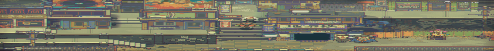

# 风来之国游戏介绍主页

换电脑了，记录备份大一学习HTML+CSS的demo。

## 项目描述

近来自国产的独立像素游戏《风来之国》发售，借此做一个相关的游戏介绍网页来介绍这款游戏，并收集感兴趣玩家的信息反馈，以此改进游戏，吸引玩家的加入。


## 涉及知识点

1、 HTML 布局

2、 文本属性

3、 图片的插入

4、 css链入式的使用

5、 选择器的使用

6、 超链接的使用

7、 列表样式

8、 事件触发效果

9、 导航模板制作

10、     表单控件

## 项目分析

### 1. HTML表结构分析

```html
<!DOCTYPE html>
<html lang="en">
<head>
	<meta charset="UTF-8">
	<meta name="viewport" content="width=device-width, initial-scale=1.0">
	<title>小杨子的游戏主页</title>
	<link rel="stylesheet" href="css/fg1.css">
</head>
<body>
	<div class="header">
		<div class="container">
  
  <div class="center">
  	<h1>小杨子的游戏主页</h1>
  </div>
	</div>
	</div>
	<div class="topnav">
		<div class="zuo">
			<ul name="daohangye">
		<a href="https://baike.baidu.com/item/%E7%A9%BA%E6%B4%9E%E9%AA%91%E5%A3%AB/16422241?fr=aladdin"><li>空洞骑士</li></a>
		<a href="https://baike.baidu.com/item/%E9%A3%8E%E6%9D%A5%E4%B9%8B%E5%9B%BD/23291372?fr=aladdin"><li>风来之国</li></a>
		</ul>
		</div>
</div>
<div class="row" id="container">
  <div class="column side">
    <h2>游戏图片</h2>
    <p></p>
   
  </div>
  
  <div class="column middle">
    <h2>游戏介绍</h2>
    <h3>前言</h3>
    <p>2021年8月12日，一款名为《风来之国》的像素风冒险游戏，在任天堂举办的IndieWorld独立游戏发布会上公布了最新的预告。几乎是转瞬之间，它就成为了玩家团体以及各大平台最炙手可热的话题。得益于某位业界大佬兔头，我有幸能够在该作正式发售前便体验了其前三章（包括序章）的内容。毫不夸张的说，在试玩结束的界面出现时，我甚至有种依依惜别之感。<br>注：上述内容花费了我整整10个小时，这还仅仅只是初步的主线剧情，不包括深入的搜集与探索。接下来，我就和大家简单聊聊《风来之国》的一些基本信息，希望能对屏幕前的你有所帮助。</p>
    <h3>幕后故事</h3>
    <p>《风来之国》的开发商，是创立于2014年8月、总部位于上海嘉定区的独立游戏工作室皮克皮。早在2016年，皮克皮就曾在互联网上公开招募关卡设计师。即便用现在的眼光来看，这则短短数百字的文案同样包含了巨量的信息。别的不说，至少文中提到的几个关键点，都与我的游戏体验基本吻合。剩下的大多数截图，也都能在游戏中找到相对应的场景。换个角度来看，上述现象意味着《风来之国》在设计伊始就有着明确的目标和完善的框架。无论是对广大玩家还是制作组本身而言，这个小插曲都是令人信心大增的好兆头。</p>
    <br>
    <h3>正文</h3>
    <h3>一.背景故事</h3>
    <p>抛开具体的事件不谈，《风来之国》本身的世界观其实并不算非常别出心裁。<br>遥远的未来世界，曾经繁盛的文明因为一场突如其来的灾难分崩离析。大多数人类都因此丧生，只剩下少部分幸存者躲进了地下的建筑中苟延残喘。<br>坚固的避难所确保了大家都能安然无恙的生活着，可是终年不见阳光的日子也让某些人心中生出了一丝悸动。<br>某位身强力壮的矿工约翰，和他捡来的神秘女孩珊，正是渴望离开这里回到地面的群体的一份子。一场有关勇气、友谊和爱的故事，就这样缓缓拉开了帷幕。游戏的开头有着一段CG，大体上讲述的是约翰发现珊的过程，顺带描绘了他们平日里生活、工作的场景。值得一提的是，某些画面会随着主线的推进得到进一步的展现。<br>为了尽量减少剧透，相关故事的具体情节我就先按下不表了。《风来之国》算是剧情向的游戏，我想大多数玩家都更喜欢自己一步步揭示真相进而决定所有人的未来吧。<br>需要指出的是，本作的剧情在表现形式上有些碎片化（也可以说是隐晦）。宁静祥和的生活只不过是残酷末世的冰山一角，隐藏在温馨恬淡的日常之下的，是出乎意料的黑暗与暴戾。值得一提的是，本作的人物塑造相当出色。可爱的小珊让人忍俊不禁，沉默寡言的约翰看上去就让人非常有安全感。<br>对话方面也十分应景与得体，虽然故事的走向不是那么具有新意，但是呈现出的效果以及蕴含的情感却让我始终记忆犹新。</p>
    <br>
    <h3>2.讨喜的画风与精细的制作</h3>
    <p>《风来之国》的画风非常讨喜，不会让人产生任何廉价感。场景的切换比较自然，响应速度也非常块。<br>与此同时，制作组也添加了一些让游戏增色不少的细节，包括但不限于比如迎风摇摆的草丛、憨态可掬的人物动作等等。</p>
    <br>
    <h3>3. 简单易懂的设定</h3>
    <p>上文的图片里，开发者已经直言《风来之国》的玩法类似《塞尔达》。不过由于我本人并没怎么玩过后者，所以这里就主要介绍游戏玩法。<br>首先是一目了然的界面，包括状态栏、日志、地图、物品、料理配方、大地之子相关界面和游戏设定七个板块。<br>状态栏顾名思义，就是显示玩家的一些基本信息，包括武器、关键道具、人物能力等等。<br>随着游戏的推进，玩家可以逐步解锁更加强力的武器。虽说我并没有用过它，不过单从外观看确实有不小的提升。</p>
    <br>
  </div>
  
  <div class="column side">
    <h2>评价</h2>
    <p>整体而言，《风来之国》基本上满足了大家对其的期待。它或许不是尽善尽美的作品，不过我认为也完全达到了佳作的标准。<br>我对《风来之国》的评价是：物有所值，符合期待。</p>
    
    <h2>游戏账号测试登录</h2>
    <form>
		用户名：<input type="text" id="yhm" placeholder="请输入用户名"><br>
		密&emsp;码：<input type="password" id="mima"><br>
		验证码：<input type="text" id="yzm" placeholder="请输入验证码"><br>
		<!-- placeholder框内提示语 -->
		<input type="submit" value="登陆" />
	</form>
	<h2>玩家信息收集</h2>
	<form>
		名字：<input type="text" name="mz"><br>
		性别：<input type="radio" name="xb">男
		<input type="radio" name="xb">女<br>
		头像：<input type="file" value="浏览…"><br>
		城市：<select > <optgroup label="城市">
			<option value="">-请选择城市-</option>
            <option>重庆</option>
            <option>北京</option>
            <option>上海</option>
            <option>等</option>
        </optgroup></select><br>
		游戏反馈：<br>
		<textarea cols="30" rows="8"></textarea><br>
		    <input type="submit" value="提交"/>
		    <input type="reset" value="充填">
	</form>
  </div>

</div>
</div>
  <div id="container">
    <footer>游戏主页</footer>
</div>
</body>
</html>
```

### 2. CSS样式分析

```css
*{ margin:0;padding:0;}
html, body { 
	height:100%;
}
html {
	min-width:980px;/*浏览器缩小时，网页显示的宽度最小为980px*/
}


img {
	border:0; 
	vertical-align:top; 
	text-align:left;
}
ul, ol { 
	list-style:none;/*取消前面的黑色圆点*/
}
div.zuo{
	color:blue;
}
/*头部*/
.header {
  background-color: #F1F1F1;
  text-align: center;
 /*这里设置边缘距离，是否填充*/
}
.container {
    position: relative;
}

.center {
    position: absolute;
    left: 0;
    top: 50%;
    width: 100%;
    text-align: center;
    font-size: 18px;
	margin-top:-9px;
}

.headimg { 
    width: 100%;
    height: auto;
    opacity: 0.3;
}
/*导航页*/
	/* 导航条 */
.topnav {
  overflow: hidden;
  background-color: #333;
}
 
	/* 导航链接 */
.topnav a {
  float: left;
  display: block;
  color: #f2f2f2;
  text-align: center;
  padding: 14px 16px;
  text-decoration: none;
}
 
	/* 链接 - 修改颜色 */
.topnav a:hover {
  background-color: #ddd;
  color: black;
}
/*内容部分*/
.column {
  float: left;
}
 
	/* 左右侧栏的宽度 */
.column.side {
  width: 25%;
}
 
	/* 中间列宽度 */
.column.middle {
  width: 50%;
}
 
	/* 响应式布局 - 宽度小于600px时设置上下布局 */
@media screen and (max-width: 600px) {
  .column.side, .column.middle {
    width: 100%;
  }
}
/*底部区域*/
#container{
    /*保证footer是相对于container位置绝对定位*/
    position:relative;  
    width:100%;
    min-height:170%; /*更改这里直接改页脚位置*/
    /*设置padding-bottom值大于等于footer的height值，以保证main的内容能够全部显示出来而不被footer遮盖；*/  
    padding-bottom: 150px;  
    box-sizing: border-box;
}
footer{
    width: 100%;
    height:30px;   /* footer的高度一定要是固定值*/ 
    position:absolute;
    bottom:0px;
    left:0px;
    background: #333;
    text-align: center;
color:white;
}
/*其它*/
a:hover{                             /*鼠标悬停*/
		color:white;
		text-decoration:underline;   /*鼠标悬停时出现下划线*/
}
```

## 项目实现

### 制作头部及导航模块

1. 预览效果


2. 模板制作

```html
	<div class="header">
		<div class="container">
  <div class="center">
  	<h1>小杨子的游戏主页</h1>
  </div>
	</div>
	</div>
	<div class="topnav">
		<div class="zuo">
			<ul name="daohangye">
		<a href="https://baike.baidu.com/item/%E7%A9%BA%E6%B4%9E%E9%AA%91%E5%A3%AB/16422241?fr=aladdin"><li>空洞骑士</li></a>
		<a href="https://baike.baidu.com/item/%E9%A3%8E%E6%9D%A5%E4%B9%8B%E5%9B%BD/23291372?fr=aladdin"><li>风来之国</li></a>
		</ul>
		</div>
</div>

```

```css

```

## 总结

第一次做网页，对网页布局没有概念，不知道怎么排版，通过看视频和CSDN搞懂基础的布局知识，又由于最近《风来之国》发售便以此为材料。在制作过程中我认为最难的并不是基础标签的使用，而是标签的排版布局和为了追求动态互动的实现。

制作开始，首先我便考虑到整个网页要的展示效果，找到了PC桌面最适合3列内容区域，并通过css优化了整个网页展示效果，使他打开后能看见所有要表达的内容题目。

在做头部，导航栏的时候我做出基础的灰白背景的头部，看起来非常的丑，和导航栏非常违和，便萌发了插入背景图的想法，通过网上的教学实现了，并理解了文字浮动于图片上和头部填充。

接下来便开始填写内容，在右栏我又尝试了上课学的表单控件。

最后打开网页发现了一个问题，我的页脚不随着内容而一直处于网页底部，导致我的文字内容超过页脚，经过反复核查发现是底部区域css中对于网页的元素最小高度缩放比例太小导致的，修改错误后整个网页布局终于正常。

## 参考

[风来之国_百度百科 (baidu.com)](https://baike.baidu.com/item/风来之国/23291372?fr=aladdin)

[一个简单的静态网页制作（html+css）_那片世界那片海的博客-CSDN博客_静态网页制作](https://blog.csdn.net/weixin_50765519/article/details/117524429)

[HTML 教程 | 菜鸟教程 (runoob.com)](https://www.runoob.com/html/html-tutorial.html)